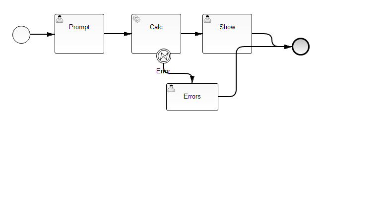

# SpringBootActivitiCalculator

Example implementation of simple calculator using Spring Boot and Activiti

WARNING!!! Needs polishing, PROOF OF CONCEPT IS WORKING!

## Working functionality

  * Start calc process
  * Display list of tasks assigned/candidates
  * Open task form
  * Fill form
  * Send form
  * Execute service task
  * Handle catch errors
  * Complete process

## UI implementation

UI is thymeleaf based.

Forms are completelty hand-written, without any dependency on technology used.

Current task complete model is POST with process.<var> = value params.

## Testing environment

  * Parameterized tests for business process
  * UI tests and BPM tests
  * Allure test framework integrated (run mvn clean test; mvn site to produce report in target/site/allure-maven-plugin)

WARNING!!!
To run local Allure report you will need to run chrome with  --allow-file-access-from-files argument.

